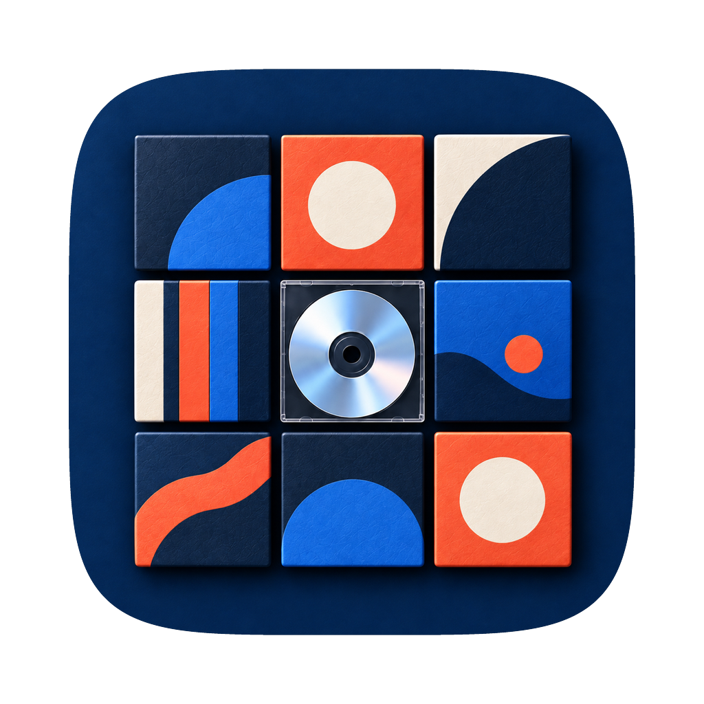
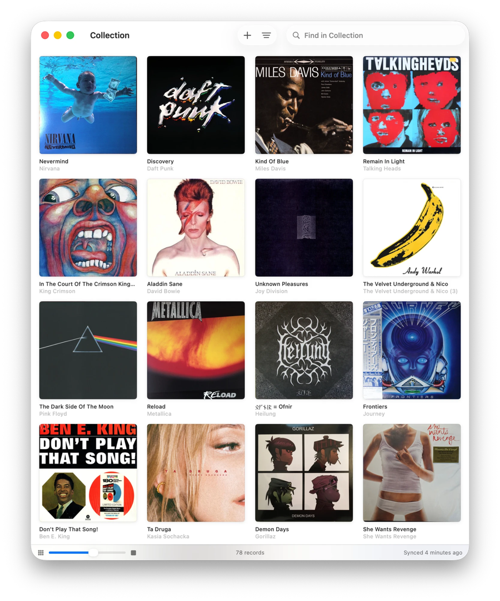
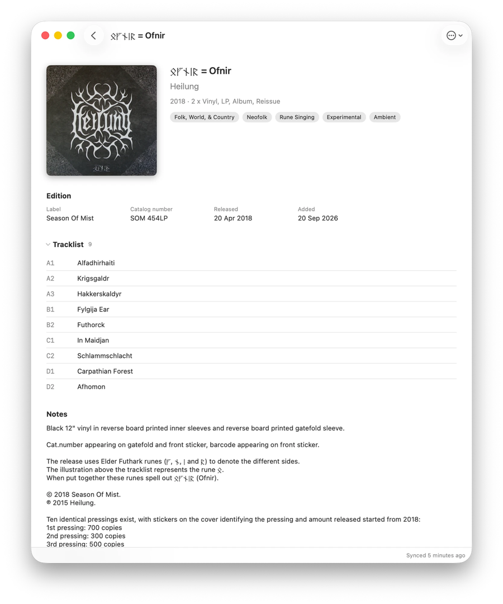

<p align="center">
  
</p>

<h1 align="center">Recogs</h1>

<p align="center">
  Your Discogs record collection, native on Mac and iPhone. One shared SwiftUI
  codebase, no backend, no third-party dependencies.
</p>

<p align="center">
  <a href="https://github.com/lysyi3m/recogs/actions/workflows/ci.yml">
    
  </a>
</p>

<p align="center">
  
  
</p>

## Features

- **Cover wall** — scalable grid of cover art with a density slider, from large sleeves down to a tight wall.
- **List** — the same collection as rows, each carrying artist, year and format, for finding rather than browsing.
- **Sort** by date added, artist, title or year, in either direction.
- **Search** the collection as you type, offline.
- **Record detail** — full-size cover, edition details, tracklist, and a link out to Discogs.
- **Add** — search Discogs, pick the exact release, confirm.
- **Remove** — from the detail screen, or a long press on any cover (right click on Mac).
- **Offline** — the whole collection stays browsable from the local cache.

Adds and removes apply to the local cache immediately and roll back if Discogs
rejects them.

## Requirements

- macOS 26 or iOS 26, or later
- Xcode 26 or later and XcodeGen, to build
- A Discogs account, to use

## Build & run

```bash
brew install xcodegen  # one-time
cp .env.example .env   # one-time; set DEVELOPMENT_TEAM to your Apple Team ID
make generate          # regenerate Recogs.xcodeproj from project.yml
open Recogs.xcodeproj  # then press ⌘R
```

Run `make` to list the other tasks (`test`, `build`, `build-ios`, `clean`).

`Recogs.xcodeproj` is generated from [`project.yml`](project.yml); it is gitignored and must not
be hand-edited. `make generate` projects `DEVELOPMENT_TEAM` from `.env` into
`Config/Local.xcconfig`, so Xcode and `xcodebuild` sign with the same team.

## Connecting to Discogs

On first launch, paste a [Personal Access Token](https://www.discogs.com/settings/developers).
It is validated against `/oauth/identity`, stored in the Keychain on that
device, and never written to logs or `UserDefaults`.

## How it works

Discogs is the source of truth; the local store is a cache. A refresh pages the
collection and upserts by `instance_id`, dropping anything the server no longer
reports.

The distinction that shapes the data model: Discogs models each *copy* you own
as an **instance** of a release inside a folder. Two copies of the same release
are two instances sharing one `release_id`, so removal keys off `instance_id`.

The API allows 60 requests per minute. Every call goes through one header-aware
throttle that reads the `X-Discogs-Ratelimit*` headers, holds back a safety
margin, and backs off on `429`. Cover art is exempt — measured against the live
API, the image CDN returns no rate-limit headers and does not consume the
budget — so images are bounded by their own concurrency cap instead. They are
cached on disk permanently and never re-fetched.

## Project structure

| Path | Purpose |
| --- | --- |
| `DiscogsKit/` | Swift package: API client, typed models, and header-aware rate limiter |
| `Sources/Kit/` | `RecogsKit` — SwiftData cache, image cache, services, and the SwiftUI feature layer |
| `Sources/App/` | The app target: `@main` and assets |
| `Tests/` | `RecogsKit` unit tests (`@testable import RecogsKit`) |
| `Config/` | `Base.xcconfig`, the privacy manifest and the iOS entitlements; `make generate` writes the rest (git-ignored) |
| `Scripts/` | `verify-installed.sh` — checks the simulator is running the build in DerivedData |

## Testing

```bash
make test
```

Runs the `DiscogsKit` package tests and the app tests. Both are offline and need
no token.

## Scope

v1 is the flows above. Deliberately out of scope for now: barcode scanning,
a zoomable infinite canvas, folder-aware UI, an offline edit queue, wantlist,
marketplace prices, and stats.

## License

MIT — see [LICENSE](LICENSE). The name and the app icon are not covered; see
[TRADEMARKS.md](TRADEMARKS.md).
